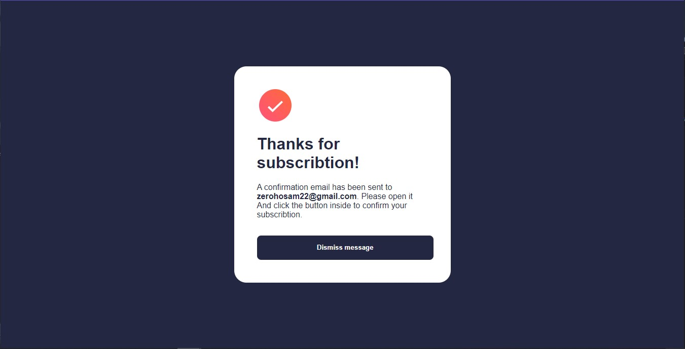

# Frontend Mentor - Newsletter sign-up form with success message solution

This is a solution to the [Newsletter sign-up form with success message challenge on Frontend Mentor](https://www.frontendmentor.io/challenges/newsletter-signup-form-with-success-message-3FC1AZbNrv). Frontend Mentor challenges help you improve your coding skills by building realistic projects. 

## Table of contents

- [Overview](#overview)
  - [The challenge](#the-challenge)
  - [Screenshot](#screenshot)
  - [Links](#links)
- [My process](#my-process)
  - [Built with](#built-with)
  - [What I learned](#what-i-learned)
  - [Continued development](#continued-development)
- [Author](#author)


## Overview

### The challenge

Users should be able to:

- Add their email and submit the form
- See a success message with their email after successfully submitting the form
- See form validation messages if:
  - The field is left empty
  - The email address is not formatted correctly
- View the optimal layout for the interface depending on their device's screen size
- See hover and focus states for all interactive elements on the page

### Screenshot





### Links

- Solution URL: https://github.com/hosam0x0/newletter-Signup.git
- Live Site URL: 

## My process

### Built with

- Semantic HTML5 markup
- CSS custom properties
- Flex
- CSS Grid
- Pure JavaScript


### What I learned

-I learnt more about DOM and how to deal with it.
-Using psedou classes (focus,Hover).
-display properties and it's behaviours.
-How to change list's bullet.
-Improved the way of searching for solution.
-Writing email's validation script.

```html
        <div class="terms">
          <h1>Stay updated!</h1>
          <p>Join 60,000+ product managers receiving monthly updates on:</p>
          <ul>
            <li><span>Product dicovery and building what matters</span></li>
            <li><span>Measuring to ensure updates are a success</span></li>
            <li><span>And much more!</span></li>
          </ul>
        </div>
```

```css
.input.error:is(:hover, :focus) {
    border: hsl(4, 100%, 67%) 1px solid;
    color: hsl(234, 29%, 20%);
    background-color: hsl(5, 100%, 93%);
}
.input.error{
    border: hsl(4, 100%, 67%) 1px solid;
    background-color: hsl(5, 100%, 93%);
}
.sub-container{
        width: 375px;
        height: 120%;
        border-radius: 0px;
        position: relative;
        background-image: url(/assets/images/illustration-sign-up-mobile.svg);
        background-repeat: no-repeat;
        box-shadow: 0 0;
    
    }
```
```js
function subscribeClick(event){
  event.preventDefault();
  const email = document.getElementById('email').value;
  if (validEmail(email) === true) {
    showSuccess();
    removeError();
    document.getElementById('successMail').innerHTML = email
  }else{
    showError
  }
}
```


### Continued development

-I want to learn how more about motion and transition, so when the user clicks to subscribe, the success pop-up message show with a lovely motion way.


## Author

- Frontend Mentor - [@hosam0x0](https://www.frontendmentor.io/profile/yourusername)
- Twitter - [@zerohosam22](https://www.twitter.com/yourusername)

